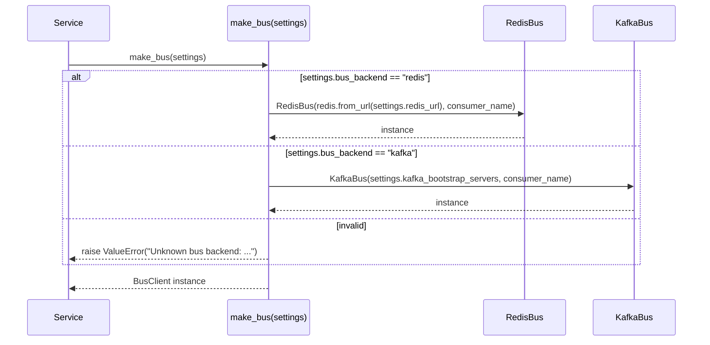
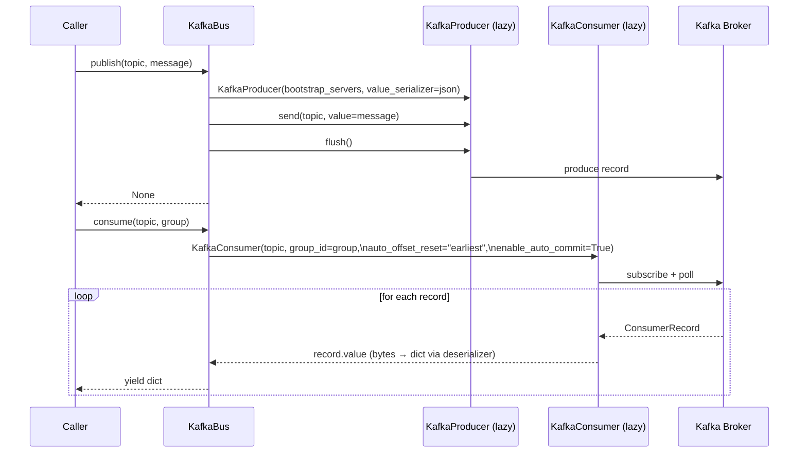
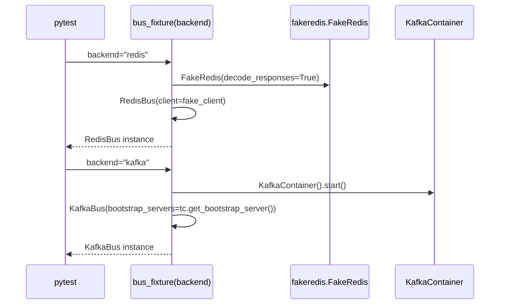

# Design Document — Stream D Implementation

## Overview

Stream D completes the platform with four tightly coupled deliverables:

1. **Bus contract test suite** (`tests/test_bus_contract.py`) — a single parametrized
   pytest file that verifies both `RedisBus` and `KafkaBus` satisfy the `BusClient`
   protocol identically.
2. **Kafka binding** — `KafkaBus` class in `common/bus.py`, new config fields in
   `common/config.py`, and a `make_bus` factory that dispatches on `bus_backend`.
3. **Kubernetes Helm chart** (`deploy/k8s/platform/`) — one-command `helm install`
   that mirrors the compose stack: 7 platform services, Redis, Postgres, migrate job.
4. **Load-testing script** (`scripts/load-test.sh`) and `docs/OPERATIONS.md` additions
   covering delivery guarantees, Kubernetes deploy instructions, and env-switch reference.

The four deliverables are ordered by dependency: the contract suite must exist before
the Kafka binding can be verified; the Helm chart and load-test script depend on a
working stack.

**Key constraints carried forward from existing design decisions:**

- `python:3.11-slim` has no native toolchain → `confluent-kafka` (requires `librdkafka`)
  is ruled out; `kafka-python>=2.0.2` is the chosen client library.
- Both bus bindings share **at-most-once** delivery semantics (Redis XACK after read;
  Kafka `enable_auto_commit=True`). Upgrading either binding to at-least-once is a
  deliberate future decision, not an accident.
- All new Kafka-dependent tests are gated behind the `kafka` pytest marker so the
  fast CI job (no Docker) continues to pass.

---

## Architecture

### Component Interaction

```mermaid
graph TD
    subgraph "common/"
        CFG[config.py\nSettings + bus_backend\n+ kafka_bootstrap_servers]
        BUS[bus.py\nRedisBus | KafkaBus\nmake_bus factory]
        IFACE[interfaces.py\nBusClient protocol]
    end

    subgraph "tests/"
        CONTRACT[test_bus_contract.py\n@pytest.mark.parametrize\nredis | kafka]
        FAKE[fakeredis.FakeRedis\n(redis fixture)]
        TC[testcontainers.KafkaContainer\n(kafka fixture)]
    end

    subgraph "deploy/"
        COMPOSE[docker-compose.yml\n+ kafka service\n(profile: kafka)]
        HELM[k8s/platform/\nChart.yaml + values.yaml\n+ templates/]
    end

    subgraph "scripts/"
        LOAD[load-test.sh\nrate control + p50/p95]
    end

    CFG --> BUS
    IFACE --> BUS
    BUS --> CONTRACT
    FAKE --> CONTRACT
    TC --> CONTRACT
    BUS --> COMPOSE
    BUS --> HELM
    LOAD --> COMPOSE
```

### make_bus Dispatch Flow



### KafkaBus Publish/Consume Flow



### Test Parametrization Flow



---

## Components and Interfaces

### 1. `common/config.py` — Settings additions

Two new fields are appended to `Settings`:

```python
bus_backend: str = "redis"          # INTELLIOPS_BUS_BACKEND; "redis" | "kafka"
kafka_bootstrap_servers: str = "localhost:9092"   # INTELLIOPS_KAFKA_BOOTSTRAP_SERVERS
```

No validation constraint is placed on `bus_backend` in the model itself — the
`make_bus` factory is the enforcement point, raising `ValueError` for unknown values.
This keeps `Settings` a pure data bag and avoids Pydantic validator coupling.

### 2. `common/bus.py` — KafkaBus and updated make_bus

#### `KafkaBus` class signature

```python
class KafkaBus:
    def __init__(self, bootstrap_servers: str, consumer_name: str = "c1") -> None: ...

    def publish(self, topic: str, message: dict) -> None:
        """Lazily import KafkaProducer, JSON-serialize message, send+flush."""

    def consume(self, topic: str, group: str) -> Iterator[dict]:
        """Lazily import KafkaConsumer, subscribe, yield deserialized dicts."""
```

Lazy import pattern used inside each method:

```python
def publish(self, topic: str, message: dict) -> None:
    from kafka import KafkaProducer  # noqa: PLC0415
    import json
    producer = KafkaProducer(
        bootstrap_servers=self._bootstrap_servers,
        value_serializer=lambda v: json.dumps(v).encode(),
    )
    producer.send(topic, value=message)
    producer.flush()
```

```python
def consume(self, topic: str, group: str) -> Iterator[dict]:
    from kafka import KafkaConsumer  # noqa: PLC0415
    import json
    consumer = KafkaConsumer(
        topic,
        bootstrap_servers=self._bootstrap_servers,
        group_id=group,
        client_id=self._consumer,
        auto_offset_reset="earliest",
        enable_auto_commit=True,
        value_deserializer=lambda b: json.loads(b.decode()),
    )
    for record in consumer:
        yield record.value
```

> **Design decision — per-call producer:** A new `KafkaProducer` is created on
> each `publish` call and flushed before return. This matches the `RedisBus` model
> (no persistent client state between publishes) and keeps the implementation
> simple. For high-throughput use a persistent producer would be preferred; at
> this project's traffic level the per-call overhead is irrelevant.

#### `make_bus` updated signature and dispatch

```python
def make_bus(settings: Settings, consumer_name: str = "c1") -> RedisBus | KafkaBus:
    if settings.bus_backend == "redis":
        return RedisBus(
            client=redis.from_url(settings.redis_url, decode_responses=True),
            consumer_name=consumer_name,
        )
    elif settings.bus_backend == "kafka":
        return KafkaBus(
            bootstrap_servers=settings.kafka_bootstrap_servers,
            consumer_name=consumer_name,
        )
    else:
        raise ValueError(
            f"Unknown bus backend: {settings.bus_backend!r}. "
            "Expected 'redis' or 'kafka'."
        )
```

### 3. `tests/test_bus_contract.py` — Contract test suite

Structure overview:

```python
import pytest
from common.interfaces import BusClient

# ── fixtures ──────────────────────────────────────────────────────────────────

@pytest.fixture(scope="session")
def kafka_bootstrap(request):
    """Session-scoped KafkaContainer; skipped if docker unavailable."""
    ...

@pytest.fixture(params=["redis", "kafka"])
def bus(request, kafka_bootstrap):
    """Parametrized BusClient fixture. redis=fakeredis, kafka=testcontainers."""
    if request.param == "redis":
        fakeredis = pytest.importorskip("fakeredis")
        from common.bus import RedisBus
        return RedisBus(client=fakeredis.FakeRedis(decode_responses=True))
    else:
        pytest.importorskip("testcontainers")
        from common.bus import KafkaBus
        return KafkaBus(bootstrap_servers=kafka_bootstrap)

# ── contract tests (run against both backends) ────────────────────────────────

def test_satisfies_protocol(bus):
    assert isinstance(bus, BusClient)

def test_publish_consume_roundtrip(bus):
    """1.4 — publish then consume returns same field values."""
    ...

def test_consumer_group_load_balancing(bus):
    """1.5 — two consumers in same group receive distinct messages."""
    ...

def test_independent_groups_fanout(bus):
    """1.6 — two consumers in different groups both receive the same message."""
    ...

def test_idempotent_group_creation(bus):
    """1.7 — calling consume with existing group does not raise."""
    ...
```

Kafka marker application — applied via `pytest_collection_modifyitems` hook in
`conftest.py` or by decorating each test with a conditional mark. The cleanest
approach uses a session-scoped autouse fixture that inspects the backend parameter:

```python
# In test_bus_contract.py, wrap kafka parametrize cases:
def pytest_configure(config):
    config.addinivalue_line("markers", "kafka: tests requiring a live Kafka broker")

# Mark kafka test cases by inspecting request.param inside the bus fixture
# and applying pytest.mark.kafka via request.applymarker.
```

Alternatively, use `pytest.param("kafka", marks=pytest.mark.kafka)` in the
`params` list of `@pytest.fixture(params=...)`.

### 4. `pyproject.toml` changes

```toml
# [project] dependencies — add:
"kafka-python>=2.0.2",

# [dependency-groups] dev — add:
"testcontainers[kafka]>=4.0",

# [tool.pytest.ini_options] markers — add:
"kafka: tests that require a real Kafka broker (testcontainers + Docker)",
```

### 5. `.github/workflows/ci.yml` — fast test job update

```yaml
- run: uv run pytest -q -m "not postgres and not kafka"
```

The `compose-smoke` job is unchanged; it runs against the default compose stack
without the `kafka` profile, so it continues to pass without a Kafka broker.

### 6. `deploy/docker-compose.yml` — Kafka service

New service appended (gated behind `kafka` profile):

```yaml
  kafka:
    image: bitnami/kafka:3.7
    profiles: [kafka]
    ports:
      - "9092:9092"
    environment:
      KAFKA_CFG_PROCESS_ROLES: controller,broker
      KAFKA_CFG_NODE_ID: "0"
      KAFKA_CFG_CONTROLLER_QUORUM_VOTERS: 0@kafka:9093
      KAFKA_CFG_LISTENERS: PLAINTEXT://:9092,CONTROLLER://:9093
      KAFKA_CFG_ADVERTISED_LISTENERS: PLAINTEXT://kafka:9092
      KAFKA_CFG_LISTENER_SECURITY_PROTOCOL_MAP: CONTROLLER:PLAINTEXT,PLAINTEXT:PLAINTEXT
      KAFKA_CFG_CONTROLLER_LISTENER_NAMES: CONTROLLER
      ALLOW_PLAINTEXT_LISTENER: "yes"
    healthcheck:
      test: ["CMD-SHELL", "kafka-topics.sh --bootstrap-server localhost:9092 --list"]
      interval: 10s
      timeout: 5s
      retries: 10
      start_period: 30s
```

Activation: `docker compose --profile kafka up -d kafka`

### 7. `deploy/k8s/platform/` — Helm chart

#### File tree

```
deploy/k8s/platform/
├── Chart.yaml
├── values.yaml
└── templates/
    ├── _helpers.tpl
    ├── configmap.yaml
    ├── service-deployment.yaml
    ├── redis.yaml
    ├── postgres.yaml
    └── migrate-job.yaml
```

#### `Chart.yaml`

```yaml
apiVersion: v2
name: intelliops
description: IntelliOps platform — agentic AIOps stack
type: application
version: 0.1.0
appVersion: "latest"
```

#### `values.yaml` (abbreviated; full content in implementation)

```yaml
image:
  repository: intelliops
  tag: latest
  pullPolicy: IfNotPresent

services:
  - name: ingestion
    module: "services.ingestion.app:app"
    port: 8000
    externalPort: 8001
  - name: correlation
    module: "services.correlation.app:app"
    port: 8000
    externalPort: 8002
  - name: rca
    module: "services.rca.app:app"
    port: 8000
    externalPort: 8003
  - name: action
    module: "services.action.app:app"
    port: 8000
    externalPort: 8004
  - name: governance
    module: "services.governance.app:app"
    port: 8000
    externalPort: 8005
  - name: feedback
    module: "services.feedback.app:app"
    port: 8000
    externalPort: 8006
  - name: read
    module: "services.read.app:app"
    port: 8000
    externalPort: 8007

env:
  AUTH_MODE: "off"
  STORE_BACKEND: postgres
  BUS_BACKEND: redis

redis:
  image: redis:7

postgres:
  image: postgres:16
  user: intelliops
  password: intelliops
  db: intelliops
```

#### `templates/_helpers.tpl`

Defines `intelliops.fullname`, `intelliops.labels`, and `intelliops.selectorLabels`
named templates used by all other templates:

```
{{- define "intelliops.fullname" -}}
{{- printf "%s-%s" .Release.Name .Chart.Name | trunc 63 | trimSuffix "-" }}
{{- end }}

{{- define "intelliops.labels" -}}
helm.sh/chart: {{ .Chart.Name }}-{{ .Chart.Version }}
app.kubernetes.io/managed-by: {{ .Release.Service }}
{{- end }}
```

#### `templates/service-deployment.yaml`

Ranges over `$.Values.services`, emitting one `Deployment` + one `Service` per entry.
The `SERVICE_MODULE` and `PORT` env vars are set from `service.module` and
`service.port`. The `intelliops-env` ConfigMap is mounted as `envFrom`:

```yaml
{{- range .Values.services }}
---
apiVersion: apps/v1
kind: Deployment
metadata:
  name: {{ .name }}
  labels:
    app: {{ .name }}
spec:
  replicas: 1
  selector:
    matchLabels:
      app: {{ .name }}
  template:
    metadata:
      labels:
        app: {{ .name }}
    spec:
      containers:
        - name: {{ .name }}
          image: "{{ $.Values.image.repository }}:{{ $.Values.image.tag }}"
          imagePullPolicy: {{ $.Values.image.pullPolicy }}
          envFrom:
            - configMapRef:
                name: intelliops-env
          env:
            - name: SERVICE_MODULE
              value: {{ .module | quote }}
            - name: PORT
              value: {{ .port | quote }}
          ports:
            - containerPort: {{ .port }}
          livenessProbe:
            httpGet:
              path: /health
              port: {{ .port }}
            initialDelaySeconds: 10
            periodSeconds: 10
---
apiVersion: v1
kind: Service
metadata:
  name: {{ .name }}
spec:
  selector:
    app: {{ .name }}
  ports:
    - port: {{ .port }}
      targetPort: {{ .port }}
{{- end }}
```

#### `templates/configmap.yaml`

```yaml
apiVersion: v1
kind: ConfigMap
metadata:
  name: intelliops-env
data:
  INTELLIOPS_AUTH_MODE: {{ .Values.env.AUTH_MODE | quote }}
  INTELLIOPS_STORE_BACKEND: {{ .Values.env.STORE_BACKEND | quote }}
  INTELLIOPS_BUS_BACKEND: {{ .Values.env.BUS_BACKEND | quote }}
  INTELLIOPS_REDIS_URL: "redis://redis:6379"
  INTELLIOPS_DATABASE_URL: "postgresql+psycopg://{{ .Values.postgres.user }}:{{ .Values.postgres.password }}@postgres:5432/{{ .Values.postgres.db }}"
```

#### `templates/redis.yaml`

```yaml
apiVersion: apps/v1
kind: Deployment
metadata:
  name: redis
spec:
  replicas: 1
  selector:
    matchLabels:
      app: redis
  template:
    metadata:
      labels:
        app: redis
    spec:
      containers:
        - name: redis
          image: {{ .Values.redis.image | quote }}
          ports:
            - containerPort: 6379
---
apiVersion: v1
kind: Service
metadata:
  name: redis
spec:
  selector:
    app: redis
  ports:
    - port: 6379
      targetPort: 6379
```

#### `templates/postgres.yaml`

```yaml
apiVersion: apps/v1
kind: Deployment
metadata:
  name: postgres
spec:
  replicas: 1
  selector:
    matchLabels:
      app: postgres
  template:
    metadata:
      labels:
        app: postgres
    spec:
      containers:
        - name: postgres
          image: {{ .Values.postgres.image | quote }}
          env:
            - name: POSTGRES_USER
              value: {{ .Values.postgres.user | quote }}
            - name: POSTGRES_PASSWORD
              value: {{ .Values.postgres.password | quote }}
            - name: POSTGRES_DB
              value: {{ .Values.postgres.db | quote }}
          ports:
            - containerPort: 5432
---
apiVersion: v1
kind: Service
metadata:
  name: postgres
spec:
  selector:
    app: postgres
  ports:
    - port: 5432
      targetPort: 5432
```

#### `templates/migrate-job.yaml`

```yaml
apiVersion: batch/v1
kind: Job
metadata:
  name: migrate
  annotations:
    "helm.sh/hook": pre-install,pre-upgrade
    "helm.sh/hook-delete-policy": before-hook-creation
spec:
  template:
    spec:
      restartPolicy: OnFailure
      containers:
        - name: migrate
          image: "{{ .Values.image.repository }}:{{ .Values.image.tag }}"
          command: ["alembic", "upgrade", "head"]
          envFrom:
            - configMapRef:
                name: intelliops-env
```

### 8. `scripts/load-test.sh` — Load testing script

#### Algorithm

```
INPUT: incidents_per_minute (default 60), duration_seconds (default 60)

DERIVED:
  interval_ms = 60_000 / incidents_per_minute   # ms between requests
  total_requests = incidents_per_minute * duration_seconds / 60

LOOP (for each request i in 1..total_requests):
  t_start = now_ms()
  POST /ingest {"events": [{source, kind, name, value, labels, ts}]}
  t_end = now_ms()
  latencies[i] = t_end - t_start
  sleep max(0, interval_ms - latencies[i])      # rate control

POST-PROCESSING:
  sort latencies
  p50 = latencies[floor(len * 0.50)]
  p95 = latencies[floor(len * 0.95)]
  total_sent = len(latencies)

OUTPUT (stdout + appended block in docs/OPERATIONS.md):
  Total events: <total_sent>
  p50 latency:  <p50> ms
  p95 latency:  <p95> ms
```

The script uses only POSIX tools (`curl`, `date`, `awk`, `sort`, `bc`) to stay
compatible with the CI `ubuntu-latest` runner and any developer machine without
extra dependencies.

Rate control is implemented by subtracting elapsed time from the desired interval
and sleeping the remainder. This is a best-effort open-loop controller; jitter at
high rates is expected.

Latency sorting and percentile selection is done with `awk` on a collected array
at the end of the run, since POSIX `sort` doesn't do numeric inline percentiles.

---

## Data Models

### Settings (additions to `common/config.py`)

| Field | Type | Default | Env var |
|---|---|---|---|
| `bus_backend` | `str` | `"redis"` | `INTELLIOPS_BUS_BACKEND` |
| `kafka_bootstrap_servers` | `str` | `"localhost:9092"` | `INTELLIOPS_KAFKA_BOOTSTRAP_SERVERS` |

### KafkaBus internal state

```python
@dataclass  # for documentation; actual impl uses __init__
class KafkaBus:
    _bootstrap_servers: str   # stored from constructor arg
    _consumer: str            # consumer_name, used as client_id
    # No persistent producer/consumer state — both are created lazily per call
```

### Bus contract test parametrization

```python
# pytest parametrize axis
backends = [
    "redis",                                   # no marker
    pytest.param("kafka", marks=pytest.mark.kafka),  # gated by kafka marker
]
```

### IngestBatch payload (used by load-test script)

```json
{
  "events": [
    {
      "source": "load-test",
      "kind": "metric",
      "name": "cpu_usage",
      "value": 0.75,
      "labels": {},
      "ts": "2026-08-20T12:00:00Z"
    }
  ]
}
```

The `fingerprint` field is intentionally omitted from the client payload; it is
computed server-side by `normalize()`. The `ts` field is set to the current
ISO-8601 UTC time at request generation time.

---

## Correctness Properties

*A property is a characteristic or behavior that should hold true across all valid executions of a system — essentially, a formal statement about what the system should do. Properties serve as the bridge between human-readable specifications and machine-verifiable correctness guarantees.*

The bus binding and `make_bus` factory are the logic layer of this feature and are well-suited for property-based testing. The Helm chart and load-test script are IaC/shell; PBT does not apply to them.

The chosen property-based testing library is **[Hypothesis](https://hypothesis.readthedocs.io/)** (`hypothesis>=6.0`), which integrates cleanly with pytest and generates arbitrarily-structured Python dicts — ideal for exercising the bus contract with varied message shapes.

Each property test must run a minimum of 100 iterations (Hypothesis default `max_examples=100`).

Tag format for each test: `# Feature: stream-d-implementation, Property <N>: <property_text>`

---

### Property 1: Bus publish/consume round-trip

*For any* dict of string key/value pairs, publishing that dict to a topic and then consuming one message from the same topic on the same bus backend returns a dict with identical field values.

**Validates: Requirements 1.4, 4.3, 4.4**

---

### Property 2: Consumer group load-balancing

*For any* list of N ≥ 2 distinct messages published to a topic, two consumers in the same consumer group will together receive all N messages with no message received by both consumers (their received sets are disjoint and their union equals the published set).

**Validates: Requirements 1.5**

---

### Property 3: Independent groups fan-out

*For any* message dict published to a topic, two consumers each subscribed to that topic under a different consumer group name will both receive that message with identical field values.

**Validates: Requirements 1.6**

---

### Property 4: Idempotent consumer group creation

*For any* topic name string and group name string, creating a consumer on the same topic/group combination a second time (i.e., calling `consume` when the group already exists) must not raise any exception.

**Validates: Requirements 1.7**

---

### Property 5: make_bus dispatch correctness

*For any* `bus_backend` value that is either `"redis"` or `"kafka"`, calling `make_bus` with a `Settings` instance containing that value returns an instance that satisfies the `BusClient` protocol and is of the correct concrete type (`RedisBus` for `"redis"`, `KafkaBus` for `"kafka"`).

**Validates: Requirements 3.1, 3.3, 3.4**

---

### Property 6: Invalid backend rejection

*For any* string that is not `"redis"` and not `"kafka"`, calling `make_bus` with a `Settings` instance containing that value as `bus_backend` must raise a `ValueError`.

**Validates: Requirements 3.5**

---

## Error Handling

### KafkaBus

| Scenario | Behavior |
|---|---|
| Broker unreachable at `publish` time | `KafkaProducer` raises `kafka.errors.NoBrokersAvailable`; propagates to caller unchanged. |
| Broker unreachable at `consume` time | `KafkaConsumer` raises on construction; propagates to caller unchanged. |
| JSON serialization failure in `publish` | `json.dumps` raises `TypeError`; propagates before any network call. |
| JSON deserialization failure in `consume` | `value_deserializer` raises `json.JSONDecodeError`; record is lost (at-most-once semantics). |

### make_bus factory

| Scenario | Behavior |
|---|---|
| `bus_backend` is neither `"redis"` nor `"kafka"` | `ValueError` with message `"Unknown bus backend: {value!r}. Expected 'redis' or 'kafka'."` |
| Redis URL malformed | `redis.from_url` raises; propagates unchanged. |
| Kafka bootstrap address malformed | Deferred to `KafkaBus` construction; `KafkaProducer`/`KafkaConsumer` raises on first use. |

### Migrate Job (Helm)

The `pre-install,pre-upgrade` hook with `before-hook-creation` delete policy ensures:
- A failed previous migration job is removed before a re-run attempt.
- Application pods do not start until the job completes successfully (Helm waits by default on pre-install hooks).
- If `alembic upgrade head` fails, `helm install` fails fast rather than starting services against an incomplete schema.

### Load-test script

| Scenario | Behavior |
|---|---|
| Ingestion service not reachable | `curl` returns non-zero; script emits a warning per failed request and continues. Final totals reflect only successful requests. |
| `docs/OPERATIONS.md` not writable | Script emits warning on stderr; stdout results are still printed. |
| `duration_seconds=0` | Script exits immediately with `total_sent=0`, skips percentile calculation. |

---

## Testing Strategy

### Unit tests (example-based, no Docker)

- `test_kafkabus_satisfies_protocol` — `isinstance(KafkaBus(...), BusClient)`
- `test_make_bus_returns_redis_bus` — `make_bus(settings_with_backend("redis"))` → `RedisBus`
- `test_make_bus_returns_kafka_bus` — `make_bus(settings_with_backend("kafka"))` → `KafkaBus`
- `test_make_bus_raises_on_unknown_backend` — `make_bus(settings_with_backend("nats"))` → `ValueError`
- `test_lazy_import` — import `KafkaBus` class; assert `"kafka"` not in `sys.modules`
- `test_enable_auto_commit` — mock `KafkaConsumer`; assert called with `enable_auto_commit=True`
- `test_kafka_marker_on_contract_tests` — inspect pytest collected items; assert kafka-parametrized cases carry `kafka` marker (run in process, no container)

### Property tests (Hypothesis, `@pytest.mark.usefixtures("bus")`, min 100 runs)

All property tests in `tests/test_bus_contract.py` run against the parametrized
`bus` fixture (both `redis` and `kafka` backends). Kafka-parametrized cases are
gated by `@pytest.mark.kafka`.

Hypothesis strategies:

```python
# Message dict strategy: str keys, str values, 1–8 pairs
message_strategy = st.dictionaries(
    st.text(alphabet=st.characters(whitelist_categories=("Lu", "Ll", "Nd")), min_size=1, max_size=20),
    st.text(min_size=0, max_size=100),
    min_size=1,
    max_size=8,
)

# Topic name strategy: simple alphanumeric strings to avoid broker validation
topic_strategy = st.text(
    alphabet="abcdefghijklmnopqrstuvwxyz0123456789",
    min_size=3,
    max_size=30,
)

# Group name strategy: same alphabet as topics
group_strategy = topic_strategy
```

Property test configuration:

```python
# In pyproject.toml or conftest.py:
# [tool.hypothesis]
# max_examples = 100
# deriving_options = "inner"
```

Each property test body follows the pattern:

```python
@given(message=message_strategy, topic=topic_strategy)
@settings(max_examples=100)
def test_publish_consume_roundtrip(bus, message, topic):
    # Feature: stream-d-implementation, Property 1: bus publish/consume round-trip
    bus.publish(topic, message)
    received = next(iter(_take(bus.consume(topic, group="g-roundtrip"), 1)))
    assert received == message
```

### Integration tests (marked `kafka`, require Docker)

- The full contract suite with `backend=kafka` exercises a real Kafka broker via `testcontainers.kafka.KafkaContainer`. Session-scoped to amortize container startup (~10–15s).
- `test_kafka_compose_service` — `docker compose --profile kafka up kafka`; assert port 9092 reachable (optional, CI-manual).

### Helm chart validation

```bash
helm lint deploy/k8s/platform/
helm template intelliops deploy/k8s/platform/ | kubeval   # optional
```

Specific assertions via `helm template` + `grep`/`yq`:
- 7 Deployments + 7 Services from `service-deployment.yaml`
- 1 Job with `helm.sh/hook: pre-install,pre-upgrade` from `migrate-job.yaml`
- ConfigMap `intelliops-env` contains `INTELLIOPS_BUS_BACKEND`
- Postgres and Redis Deployments present

### Load test

Manual execution after standing up the compose stack:

```bash
docker compose -f deploy/docker-compose.yml up -d
bash scripts/load-test.sh 60 60   # 60 req/min for 60s
```

Verify:
- stdout contains `Total events:`, `p50 latency:`, `p95 latency:`
- `docs/OPERATIONS.md` gains a timestamped results block

### CI matrix summary

| Job | Marker filter | Docker required |
|---|---|---|
| `test` (fast) | `not postgres and not kafka` | No |
| `test-postgres` (optional slow) | `postgres` | Yes (testcontainers) |
| `test-kafka` (optional slow) | `kafka` | Yes (testcontainers) |
| `compose-smoke` | N/A | Yes (compose) |
